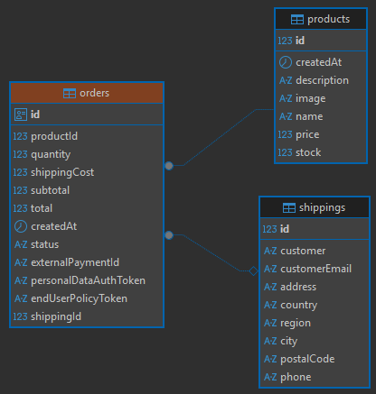

# 🛒 Product Purchase System

¡Bienvenido al **Product Purchase System**! Este proyecto  permite la compra de productos integrando una pasarela de pagos profesional y siguiendo estándares de arquitectura de software de alto nivel.

El sistema se divide en dos grandes componentes: un **Backend** desarrollado con NestJS y un **Frontend** construido con Vue 3.

---

## 🏗️ Arquitectura: Patrón Hexagonal

El núcleo de este proyecto reside en su arquitectura. Se implementó **Arquitectura Hexagonal (Ports & Adapters)** en el backend para garantizar:

*   **Independencia de Frameworks:** La lógica de negocio no depende de NestJS ni de ninguna librería externa.
*   **Mantenibilidad:** El desacoplamiento facilita el cambio de adaptadores (por ejemplo, cambiar la base de datos o la pasarela de pagos) sin afectar la lógica central.

### Estructura de Capas:
1.  **Dominio (Domain):** Contiene las entidades, modelos y contratos (interfaces) de los repositorios.
2.  **Aplicación (Application):** Casos de uso que orquestan la lógica de negocio.
3.  **Adaptadores (Adapters):** 
    *   **Input (Primarios):** Controladores REST que exponen la funcionalidad.
    *   **Output (Secundarios):** Implementaciones de persistencia (Postgres/TypeORM) y servicios externos (Wompi API).

---

## 🛠️ Stack Tecnológico

### 🚀 Backend (NestJS)
*   **Framework:** [NestJS](https://nestjs.com/) para una estructura escalable y eficiente.
*   **Persistencia:** SQL con **PostgreSQL** y **TypeORM**.
*   **Pagos:** Integración con la API de **Wompi**.
*   **Validación:** Uso de decorators y pipes para asegurar la integridad de los datos.

### 🎨 Frontend (Vue 3)
*   **Framework:** [Vue 3](https://vuejs.org/) (Composition API).
*   **Estado:** **Vuex** para una gestión reactiva y centralizada.
*   **UI Components:** [PrimeVue](https://primevue.org/) para una interfaz profesional y componentes listos para producción.
*   **Estilos:** **TailwindCSS** para un diseño moderno y responsive.
*   **Validación:** **Zod** + **Vee-Validate** para formularios robustos.

---

## 📊 Diagrama de Base de Datos

El diseño relacional asegura la trazabilidad de las órdenes, productos e información de envío.



---

## 🎥 Video Demostrativo

Puedes ver el flujo completo desde la selección del producto hasta la confirmación del pago en el siguiente video:

> [!TIP]
> **Haz clic aquí para ver el video:** [product_purchase.mp4](img/product_purchase.mp4)

---

## 📮 API Documentation (Postman)

Puedes importar la colección de Postman para probar los endpoints del backend:

*   [product_purchase.postman_collection.json](product_purchase.postman_collection.json)
---

## 📮 API Documentation (Postman)

Puedes importar la colección de Postman para probar los endpoints del backend:

*   [product_purchase.postman_collection.json](product_purchase.postman_collection.json)

---

## 🚀 Instalación y Uso

### 🔧 Requisitos Previos
*   Node.js (v20 o superior)
*   PostgreSQL
*   Docker (opcional para ejecución rápida de base de datos)

### 1️⃣ Clonar el Repositorio
```bash
git clone https://github.com/tu-usuario/product_purchase.git
cd product_purchase
```

### 2️⃣ Configurar el Backend
```bash
cd backend
npm install
# Crea un archivo .env basado en la configuración de la base de datos y llaves de Wompi
npm run start:dev
```

### 3️⃣ Configurar el Frontend
```bash
cd frontend
npm install
npm run dev
```

---

## 📂 Estructura del Proyecto

```text
product_purchase/
├── backend/                # API REST con NestJS
│   ├── src/
│   │   ├── adapter/        # Adaptadores Input/Output
│   │   ├── domain/         # Lógica de dominio y contratos
│   │   ├── modules/        # Inyección de dependencias de NestJS
│   │   └── main.ts         # Punto de entrada
├── frontend/               # Cliente SPA con Vue 3
│   ├── src/
│   │   ├── components/     # Componentes PrimeVue personalizados
│   │   ├── store/          # Módulos de Vuex
│   │   ├── views/          # Páginas principales
│   │   └── main.ts
├── img/                    # Activos visuales (Diagramas y Videos)
└── README.md
```
